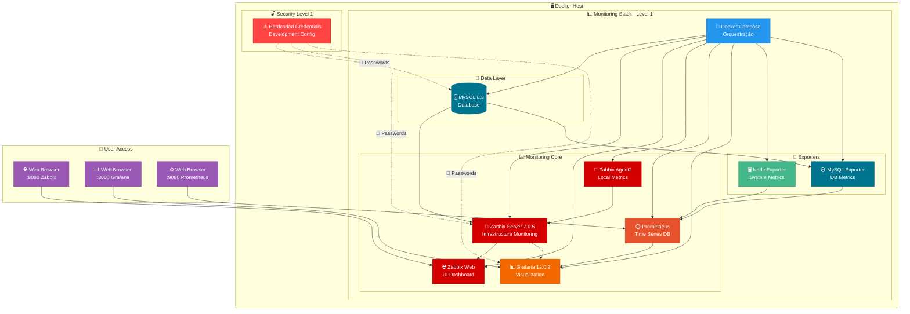
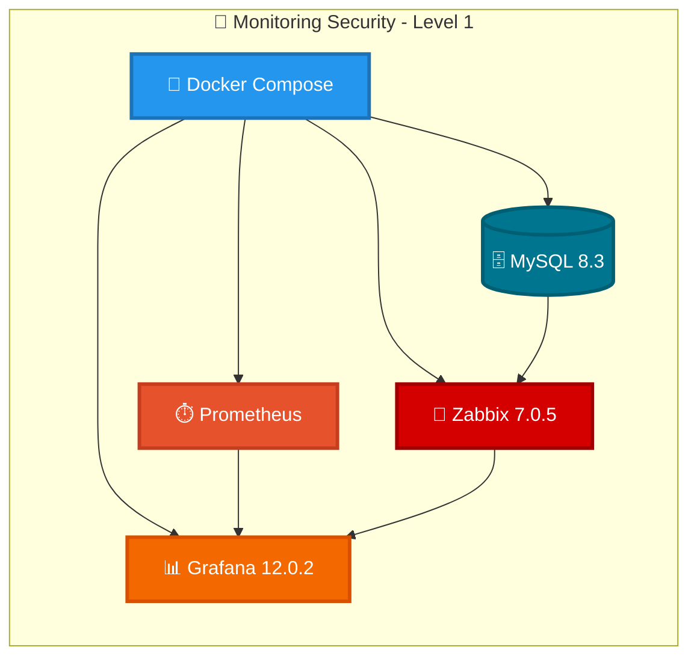
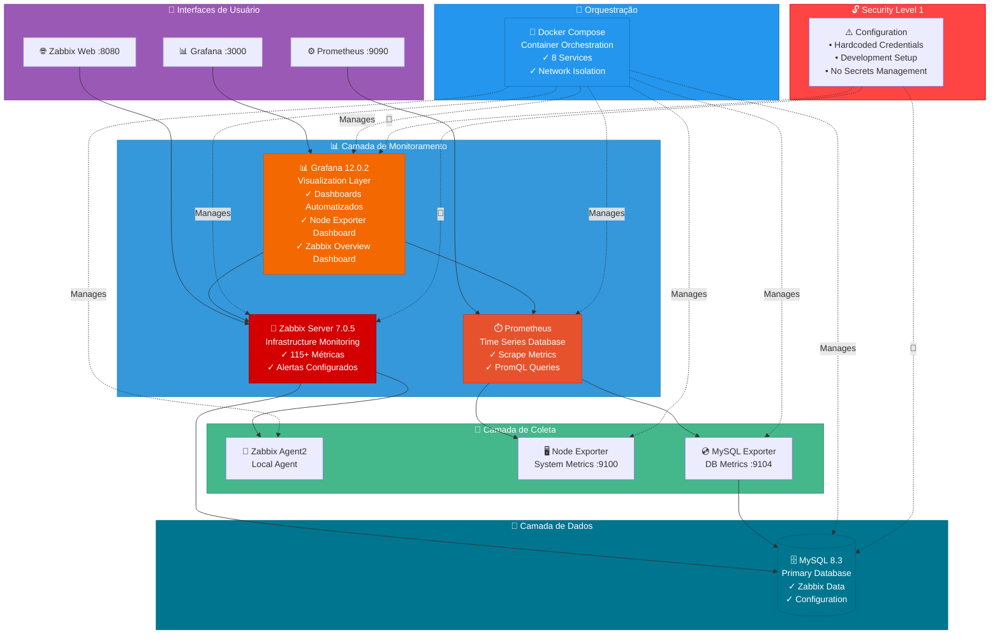

# Diagramas Mermaid - Monitoring Security Level 1

## 📊 Diagrama 1: COMPLETO (Para README)



---

## 🎯 Diagrama 2: SIMPLIFICADO (Para Capa do Portfólio)



---

## 🎨 Diagrama 3: ALTERNATIVO - Arquitetura em Camadas (Para README)



---

## 💡 Como Usar

### Para visualizar no VS Code:
1. Instale a extensão "Markdown Preview Mermaid Support"
2. Abra este arquivo e use `Ctrl+Shift+V` para preview

### Para converter em imagem:
1. **Mermaid Live Editor**: https://mermaid.live/
2. **Mermaid CLI**: 
   ```bash
   npm install -g @mermaid-js/mermaid-cli
   mmdc -i diagramas-mermaid.md -o diagrama.png
   ```
3. **VS Code Extension**: Use "Markdown PDF" ou similar

### Recomendação de uso:
- **Diagrama 1 (Completo)**: Melhor para README - mostra fluxo completo
- **Diagrama 2 (Simplificado)**: Ideal para capa do portfólio - clean e direto
- **Diagrama 3 (Camadas)**: Alternativa para README - visão arquitetural

---

## 🎨 Personalizações Possíveis

Se quiser ajustar:
- **Cores**: Modifique os valores `fill` e `stroke` nos `style`
- **Ícones**: Adicione/remova emojis conforme preferência
- **Informações**: Ajuste os textos e labels
- **Layout**: Mude `graph TB/LR` para alterar direção (TB=top-bottom, LR=left-right)
